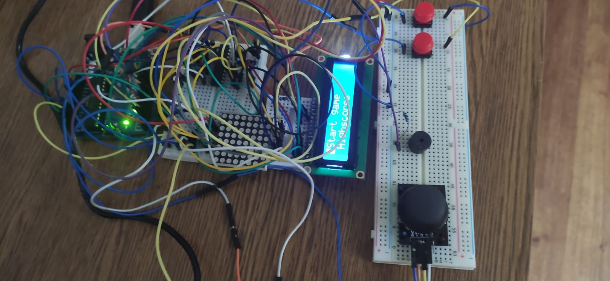

# Defuse-the-bomb-Game
My first project for the Introduction To Robotics course in my third year of Bachelor's at FMI Unibuc.

## Game description
Defuse the bomb by submitting the correct combination of symbols. At the beginning of each round the matrix will show the defuse combination, make sure you can remember it. At higher difficulty you might be tricked by a reverse symbol.

## How to play
At the start of a round the matrix will show the symbols you need to submit. Upon completeing a round the number of symbols or the difficulty level will increase. At difficulty level 3 the symbols might be reversed by having a dot in each corner so you will have to submit the opposite symbol. Get as many points as you can and save your name in the Highscores list.

## Components
* 8x8 LED Matrix
* LCD Display
* Arduino Uno Board
* Joystick
* 2 capacitors (1x 104 ceramic and 1x 10 uF)
* 3 breadboards (of different sizes)
* A lot of cables
* Matrix driver
* 2 buttons
* 1 buzzer

## Setup

## Video showcase: https://www.youtube.com/watch?v=pHbv_DEskZ0
